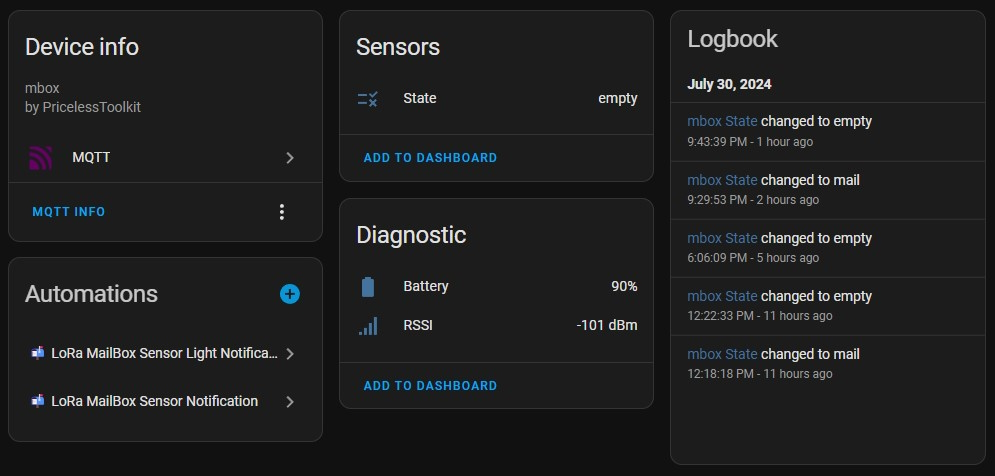

## ⚠️ MailBox Guard Production is Discontinued. The New version "[PirBOX-LITE](https://github.com/PricelessToolkit/PirBOX-LITE) or [PirBOX-MAX](https://github.com/PricelessToolkit/PirBOX-MAX)"


🤗 Please consider subscribing to my [YouTube channel](https://www.youtube.com/@PricelessToolkit/videos)
Your subscription goes a long way in backing my work.


[](https://ko-fi.com/U6U2QLAF8)

# Long Range "LoRa" Universal MailBox Sensor

### Can be integrated with Home Assistant, used via WhatsApp, or be operated offline.



### Use Cases

- Mailbox Sensor - "Code examples are provided"
- Alarm / Motion Sensor

### How it works - Mailbox Use Case

The Mailbox Guard is a device that detects when a new letter or package has been delivered to your mailbox using a PIR sensor and door reed switch. It can send a signal to your LoRa gateway, then the gateway sends a message via WiFi to `Home Assistant "MQTT" or its "API"` or to `WhatsApp` allowing you to receive notifications directly into your phone. Or you can use it offline, the gateway display will show the number of letters received, Battery status, and signal strength.

### Links

- YouTube video https://youtu.be/gf1WWKyEnbg
- My Shop

  - Mailbox Sensor [https://www.pricelesstoolkit.com/](https://www.pricelesstoolkit.com/en/projects/34-41-mailbox-guard-wireless-ir-sensor.html)
  - UNIProg Programmer [https://www.pricelesstoolkit.com/](https://www.pricelesstoolkit.com/en/projects/33-uniprog-uartupdi-programmer-33v.html)
  - Official Multiprotocol Gateway CapiBridge [https://www.pricelesstoolkit.com/](https://www.pricelesstoolkit.com/en/projects/42-129-capibridge-gateway-kit.html#/41-frequency-868_915_mhz)

- Gateway on Aliexpress [LILYGO® TTGO LoRa32 V2.1_1.6 Version 433/868/915Mhz](https://s.click.aliexpress.com/e/_DdCLj19)
- Pogo Pin Clamp [6 Pin Minimum 2.54mm pitch ](https://s.click.aliexpress.com/e/_Dm94yBf)
- Reed Switch "Normally open When the magnet is far away" "For soldering on PCB" https://s.click.aliexpress.com/e/_DkA1Sjp
- Reed Switch with cable "Normally open When the magnet is far away" https://s.click.aliexpress.com/e/_DFNJv1h
- Battery [Li-Ion 14500 800mA](https://s.click.aliexpress.com/e/_DDtU0iT)
- USB Battery charger "just in case" https://s.click.aliexpress.com/e/_DkDAztD

### Sensor Specifications

- Microcontroller "Attiny1616"
- LoRa Bands "433/868/915"
- PIR Sensor AM312 "With the option to turn it off"
- Onboard reed switch "optional"
- External reed switch "Input 2 Pin"
- Battery Holder for "Li-Ion 14500"
- Optional 2 Pin SMD LiPo Battery connector
- Build-in Battery Charger "Can be separated"
  - Connector USB-C
  - Charge status LED "Charging, Full"
- Extremely Low Power Consumption
  - Motion Sensor PIR 11.30uAh
  - Only reed switch 280nAh
  - Every data submission uses 65uA
  - TX LED "With the option to turn it off"
- Size
  - With charger "XXmm to XXmm"
  - Without charger "XXmm to XXmm"
- Programming Protocol
  - UPDI / Serial2UPDI

____________

## 📣 Updates, Bugfixes, and Breaking Changes

> [!NOTE]
>  If you're ready to contribute to the project, your support would be greatly appreciated.

- **22.05.2025** - Breaking Change (XOR obfuscation "Encryption" for LoRa).
- - CapiBridge and MailBox Guard firmware need to be updated.
- **08.05.2025**
  - MailBox Guard Production is Discontinued. The New version "[PirBOX-LITE](https://github.com/PricelessToolkit/PirBOX-LITE) or PirBOX-MAX"
- **30.07.2024**
  - New multisensor Gateway firmware `LoRa_Gateway_MQTT_JSON.ino`
  - Sensor firmware cleanup `Mailbox_Guard_Sensor_MQTT_JSON.ino`

____________


# ⚠️ Battery Polarity ⚠️

- Before connecting the battery, make sure to check the connector polarity on your battery. This is especially important because many 1S LiPo batteries have inverted polarity.


# Arduino IDE Setup

> [!NOTE]
>  For the Library "megaTinyCore" the official recommendation is. Only versions of the Arduino IDE downloaded from https://arduino.cc should be used, NEVER from a Linux package manager. The golden standard is "V1.8.13".

- Additional Boards Manager URLs

  - ESP32 https://raw.githubusercontent.com/espressif/arduino-esp32/gh-pages/package_esp32_dev_index.json
  - megaTinyCore http://drazzy.com/package_drazzy.com_index.json

- Libraries Used
  - LoRa
  - PubSubClient
  - ArduinoJson.h
  - ESP8266 and ESP32 OLED driver for SSD1306 displays
  - UrlEncode
  - HARestAPI "Sketch > Include Library > Add .ZIP Library..."
    - https://github.com/debsahu/HARestAPI
  
-------------

# Choosing a Gateway Hardware
1. [CapiBridge LoRa/ESP-NOW Gateway](https://github.com/PricelessToolkit/CapiBridge): I developed this project, featuring multi-protocol support, including LoRa and ESP-NOW. It will be compatible with my future LoRa and ESP-NOW sensor projects. Purchasing this gateway will support my ongoing open-source developments.
2. LilyGo LoRa Board: This option is more affordable but only supports LoRa. It may not be compatible with all future projects.

# Choosing Firmware for LoRa Gateway

1. **`LoRa_Gateway_MQTT_JSON.ino`** - 🆕 "Home Assistant MQTT Autodiscovery": Automatically discovers and integrates sensors with Home Assistant via MQTT.
   
2. **`LoRa_Gateway_OLED.ino`** - "For Offline Use": Displays new mail notifications, including letter count, signal strength, and battery status. Requires a reset after mail retrieval.

3. **`LoRa_Gateway_WhatsApp.ino`** - Sends a "You have new mail" message to WhatsApp.

4. **`LoRa_Gateway_MQTT.ino`** - Sends raw messages and RSSI to an MQTT server.

5. **`LoRa_Gateway_HARestAPI.ino`** - Sends new mail notifications to Home Assistant via REST API.


# Gateway Configuration

> [!NOTE]
>  If you are using CapiBridge Gateway, configure it using the [Capibridge](https://github.com/PricelessToolkit/CapiBridge) page.

## Select TTGO_LoRa Board Version

- In Arduino IDE select Tools > Board > ESP32 Arduino > `ESP32 Dev Module`
- Change the BOARD definition in `board.h` according to your Lilygo gateway HW Version " 1 = ENABLE / 0 = DISABLE ".

```c
#define LORA_V1_0_OLED  0
#define LORA_V1_2_OLED  0
#define LORA_V1_3_OLED  0
#define LORA_V1_6_OLED  0
#define LORA_V2_0_OLED  1
```

### TTGO Boards GPIOs

| Name        | V1.0 | V1.2(T-Fox) | V1.3 | V1.6 | V2.1 |
| ----------- | ---- | ----------- | ---- | ---- | ---- |
| OLED RST    | 16   | N/A         | N/A  | N/A  | N/A  |
| OLED SDA    | 4    | 21          | 4    | 21   | 21   |
| OLED SCL    | 15   | 22          | 15   | 22   | 22   |
| SDCard CS   | N/A  | N/A         | N/A  | 13   | 13   |
| SDCard MOSI | N/A  | N/A         | N/A  | 15   | 15   |
| SDCard MISO | N/A  | N/A         | N/A  | 2    | 2    |
| SDCard SCLK | N/A  | N/A         | N/A  | 14   | 14   |
| DS3231 SDA  | N/A  | 21          | N/A  | N/A  | N/A  |
| DS3231 SCL  | N/A  | 22          | N/A  | N/A  | N/A  |
| LORA MOSI   | 27   | 27          | 27   | 27   | 27   |
| LORA MISO   | 19   | 19          | 19   | 19   | 19   |
| LORA SCLK   | 5    | 5           | 5    | 5    | 5    |
| LORA CS     | 18   | 18          | 18   | 18   | 18   |
| LORA RST    | 14   | 23          | 23   | 23   | 23   |
| LORA DIO0   | 26   | 26          | 26   | 26   | 26   |

## Setting up WIFI and LoRa in the Gateway
- Firmware `LoRa_Gateway_MQTT_JSON.ino`
- Configuration File `config.h`
- The LoRa settings in the gateway and in the sensor must match.

```c
/////////////////////////// Gateway Key ///////////////////////////

#define GATEWAY_KEY "xy" // Keep it short

///////////////////////////////////////////////////////////////////////////////

////////////////////////////// WIFI / MQTT ////////////////////////////////////
#define WIFI_SSID "wifi-name"
#define WIFI_PASSWORD "wifi-password"
#define MQTT_USERNAME "mqtt-username"
#define MQTT_PASSWORD "mqtt-password"
#define MQTT_SERVER "IP-Address"
#define MQTT_PORT 1883


////////////////////////// LoRa Config ////////////////////////////////////////

#define SIGNAL_BANDWITH 125E3  // signal bandwidth in Hz, defaults to 125E3
#define SPREADING_FACTOR 8    // ranges from 6-12, default 7 see API docs
#define CODING_RATE 5          // Supported values are between 5 and 8, corresponding to coding rates of 4/5 and 4/8. The coding rate numerator is fixed at 4.
#define SYNC_WORD 0x12         // byte value to use as the sync word, defaults to 0x12
#define PREAMBLE_LENGTH 6      // Supported values are between 6 and 65535.
#define TX_POWER 20            // TX power in dB, defaults to 17, Supported values are 2 to 20
#define BAND 868E6             // 433E6 / 868E6 / 915E6

///////////////////////////////////////////////////////////////////////////////
```

The remaining is to upload the code into the LilyGo board after that the "LoRaGateway" RSSI entity will appear in the MQTT devices list.


# Mailbox Sensor configuration and Programming

For programming MailBox Guard, you need any 3.3V "UPDI programmer" You can use my other open-source project "UNIProg Programmer" [GitHub](https://github.com/PricelessToolkit/UNIProg_Programmer)

### UPDI Connection Diagram

| UNIProg | MailBox Guard |
| ------- | ------------- |
| GND     | GND           |
| 3v3     | 3v3           |
| UPD     | UPD           |

1. In Arduino IDE select the programmer "SerialUPDI-230400 baud"
2. Select board configuration as shown below "screenshot"


3. Open Sensor firmware `Mailbox_Guard_Sensor_MQTT_JSON.ino` then change  `sensor name`, `gateway key`, and `LoRa` settings according to your needs.

> [!NOTE]
> The LoRa settings must match the gateway ones.

```c

///////////////////////////////// CHANGE THIS /////////////////////////////////

#define SIGNAL_BANDWITH 125E3
#define SPREADING_FACTOR 8
#define CODING_RATE 5
#define SYNC_WORD 0xF3
#define PREAMBLE_LENGTH 6
#define TX_POWER 20
#define BAND 868E6  // 433E6 / 868E6 / 915E6
#define NODE_NAME "mbox" // The name of your sensor must be unique.
#define GATEWAY_KEY "xy" // must match the Gateway key.

///////////////////////////////////////////////////////////////////////////////

```
3. Click "Upload Using Programmer" or "Ctrl + Shift + U"

Done! Once the sensor is triggered for the first time, it will appear in the MQTT devices list on Home Assistant.

# Home Assistant Configuration


## "Automation" Sensor Notification

<details>
<summary>Explanation Click here</summary>

This automation is set up to notify a mobile device when new mail is detected in the mailbox. This setup ensures that whenever new mail is detected by the mailbox sensor, a high-priority notification with relevant details and an image is sent to the specified mobile device. The details of the automation are as follows:

#### Trigger
- **Platform:** State
- **Entity:** `sensor.mbox_state`
- **To State:** `mail`
- **For Duration:** 1 second
- **From State:** Not specified (null)

This means that the automation will trigger when the state of `sensor.mbox_state` changes to `mail` and remains in that state for at least 1 second. The "From State" being null indicates that the trigger does not depend on the previous state of the sensor.

#### Condition
There are no conditions specified, so this automation will run whenever the trigger criteria are met.

#### Action
- **Service:** `notify.mobile_app_doogee_v20pro`
- **Data:**
  - **Message:** "Mailbox is Full!"
  - **Title:** "New Mail!"
  - **Additional Data:**
    - **URL:** `/lovelace/home` - A link to the Home Assistant dashboard.
    - **Persistent:** `true` - Ensures the notification stays on the device until manually dismissed.
    - **Importance:** `high` - Sets the priority of the notification.
    - **Channel:** `MailBox` - Specifies the notification channel, useful for Android devices.
    - **Tag:** `mailbox` - A tag to help categorize the notification.
    - **Image:** `/media/local/notify/mailbox.jpg` - An image included in the notification.
    - **Actions:**
      - **Action:** `received` - A custom action identifier.
      - **Title:** "I took the parcel" - A label for the action button in the notification.

#### Mode
- **Mode:** `single` - Ensures that only one instance of this automation can run at a time.

</details>

```yaml

alias: 📬 LoRa MailBox Sensor Notification
description: ""
trigger:
  - platform: state
    entity_id:
      - sensor.mbox_state
    to: mail
    for:
      hours: 0
      minutes: 0
      seconds: 1
    from: null
condition: []
action:
  - service: notify.mobile_app_doogee_v20pro
    data:
      message: Mailbox is Full !
      title: New Mail!
      data:
        url: /lovelace/home
        persistent: true
        importance: high
        channel: MailBox
        tag: mailbox
        image: /media/local/notify/mailbox.jpg
        actions:
          - action: received
            title: I took the parcel
mode: single

```


## "Automation"  MailBox Dismiss Notification from Notification

<details>
<summary>Explanation Click here</summary>

This automation is designed to handle the dismissal of a notification when a specific action is triggered on a mobile device. Works by sending an MQTT message to update the state of the mailbox sensor and then clearing the corresponding notifications on specified mobile devices. The details of the automation are as follows:

#### Trigger
- **Platform:** Event
- **Event Type:** `mobile_app_notification_action`
- **Event Data:**
  - **Action:** `received`

This means the automation is triggered when the mobile app receives a notification action event with the action identifier `received`.

#### Condition
There are no conditions specified, so this automation will run whenever the trigger criteria are met.

#### Action
1. **Service:** `mqtt.publish`
   - **Data:**
     - **QoS:** `0` - Quality of Service level.
     - **Retain:** `true` - Retains the message on the MQTT broker.
     - **Topic:** `homeassistant/sensor/YourSensorName/state` - The MQTT topic to publish to.
     - **Payload:** `empty` - The message content, indicating the mailbox state is now empty.

2. **Service:** `notify.mobile_app_doogee_v20pro`
   - **Data:**
     - **Message:** `clear_notification` - Clears the notification.
     - **Data:**
       - **Tag:** `mailbox` - Identifies which notification to clear.

3. **Service:** `notify.mobile_app_oneplus8t`
   - **Data:**
     - **Message:** `clear_notification` - Clears the notification.
     - **Data:**
       - **Tag:** `mailbox` - Identifies which notification to clear.

#### Mode
- **Mode:** `single` - Ensures that only one instance of this automation can run at a time.

</details>

```yaml

alias: 📬 LoRa MailBox Dismiss Notification
description: ""
trigger:
  - platform: event
    event_data:
      action: received
    event_type: mobile_app_notification_action
condition: []
action:
  - service: mqtt.publish
    data:
      qos: 0
      retain: true
      topic: homeassistant/sensor/YourSensorName/state
      payload: empty
  - service: notify.mobile_app_doogee_v20pro
    data:
      message: clear_notification
      data:
        tag: mailbox
  - service: notify.mobile_app_oneplus8t
    data:
      message: clear_notification
      data:
        tag: mailbox
mode: single


```


## "Script" MailBox Status Reset for using from Dashboard

```yaml
alias: MailBox Status Reset and Dismiss Notification
sequence:
  - service: mqtt.publish
    data:
      qos: "0"
      retain: true
      topic: homeassistant/sensor/YourSensorName/state
      payload: empty
  - service: notify.mobile_app_doogee_v20pro
    data:
      data:
        tag: mailbox
      message: clear_notification
  - service: notify.mobile_app_oneplus8t
    data:
      message: clear_notification
      data:
        tag: mailbox
mode: single

```
